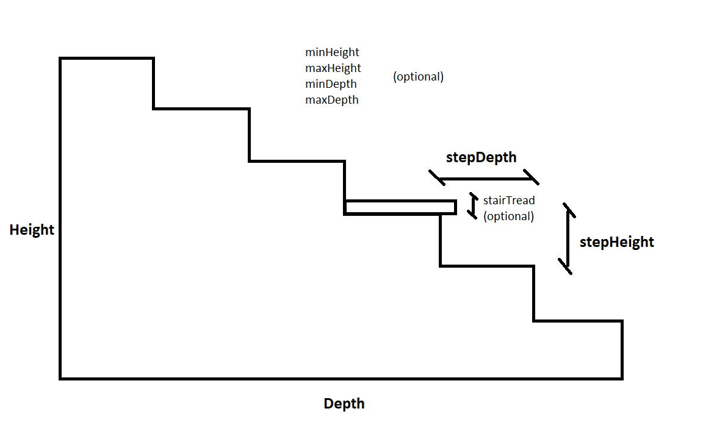

# StairsCalculator

## Overview
StairsCalculator is a web application built with Flask that helps you calculate the dimensions of stairs based on a json user input.

## Features
- Calculate the number of steps
- Determine the height and depth of each step
- insert additional input

## Installation
1. Clone the repository:
    ```bash
    git clone https://github.com/TerranovaMatteo/StairsCalculator.git
    ```
2. Navigate to the project directory:
    ```bash
    cd StairsCalculator
    ```
3. Create a virtual environment:
    ```bash
    python -m venv venv
    ```
4. Activate the virtual environment:
    - On Windows:
        ```bash
        venv\Scripts\activate
        ```
    - On macOS/Linux:
        ```bash
        source venv/bin/activate
        ```
5. Install the required dependencies:
    ```bash
    pip install -r requirements.txt
    ```
## Setting Environment Variables
 - Before running the application, you need to set up some environment variables. Create a `.env` file in the root directory of the project and add the following variables:
    ```
    SQLALCHEMY_DATABASE_URI=sqlite:///database_name.db
    SECRET_KEY=your_secret_key
    SQLALCHEMY_TRACK_MODIFICATIONS=False
    ```
    Replace `your_secret_key` with a secure key of your choice.

## Usage
- On Windows:
    ```bash
    py app.py
    ```
- On macOS/Linux:
    ```bash
    python3 app.py
    ```
- Open your web browser and go to `http://127.0.0.1:5000`.

